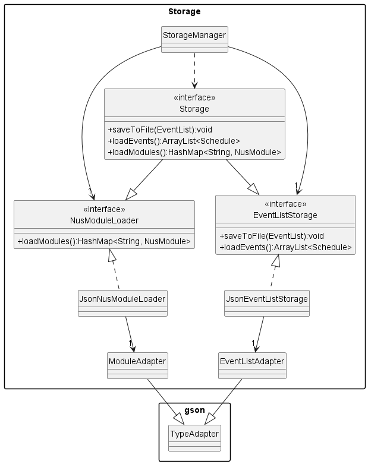
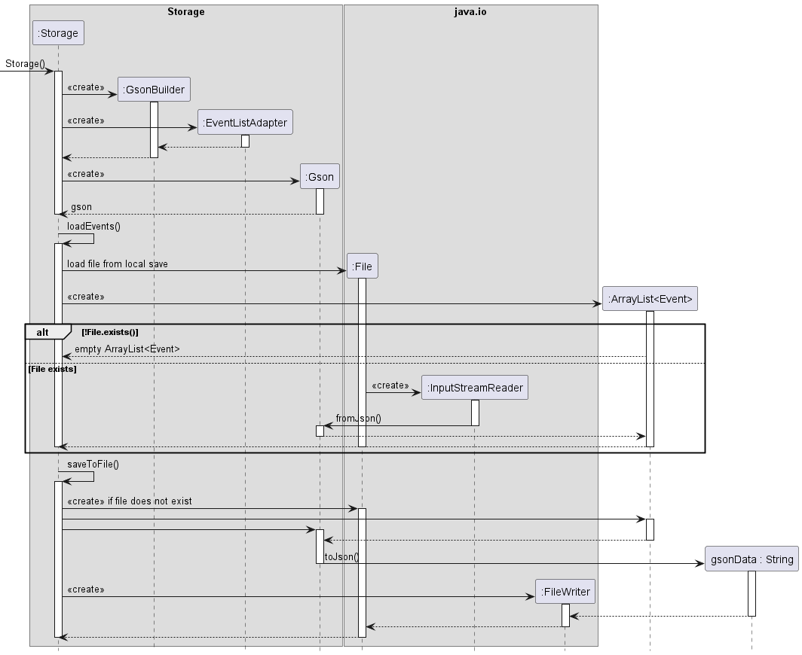

# Developer Guide
Welcome to the NUSPlanner Developer Guide!
We hope this documents serves useful to understand the behind-the-scenes working of our product. 

## Table of Contents

## Acknowledgements

{list here sources of all reused/adapted ideas, code, documentation, and third-party libraries -- include links to the original source as well}'

## Getting started

Refer to the user guide [here](https://github.com/AY2223S2-CS2113-F13-3/tp/blob/master/docs/UserGuide.md).

## Design & implementation

{Describe the design and implementation of the product. Use UML diagrams and short code snippets where applicable.}

### Parser Component
The component will return the correct command based on what the user inputs into the application.

#### How is the feature implemented?

The Parser component parses the command of the user input and breaks the user input into different parts based on the flags.
This component also ensures to validate that user input is correct.

#### Why is the feature implemented this way?

This component should be able to guide the user to inputting the correct format of the command to do data validation.
It should be able to perform basic data validation checks to ensure that the user does not enter any invalid commands.
This makes life easier to developers in the future if they wish to add new features that requires users to use new commands.

### Storage Component
API: `Storage.java`

The storage component reads and writes user data from a local save in the form of a `.json` file.
The Storage component:
* Serializes and deserializes user data into a `.json` file format through the use of the Gson library
* Saves and loads information from the local hard disk

The class diagram below illustrates the structure of the storage package

#### How the feature is implemented:

When the application starts up, the storage loadEvents() function will be called to load contents in the save file. 
Similarly, the state of the user's event list is saved when the user exits the application by calling saveToFile().

#### Justification for using gson
The Gson library was chosen as it allowed for flexible adaptation of its TypeAdapter class, allowing for custom 
serialization and deserialization of data to be saved. 

## Product scope
### Target user profile

{Describe the target user profile}

### Value proposition

{Describe the value proposition: what problem does it solve?}

## User Stories

|Version| As a ... | I want to ... | So that I can ...|
|--------|----------|---------------|------------------|
|v1.0|new user|see usage instructions|refer to them when I forget how to use the application|
|v2.0|user|find a to-do item by name|locate a to-do without having to go through the entire list|

## Non-Functional Requirements

{Give non-functional requirements}

## Glossary

* *glossary item* - Definition

## Instructions for manual testing

{Give instructions on how to do a manual product testing e.g., how to load sample data to be used for testing}

### EventList component 

API: Eventlist.java

the EventList component:

- stores a ArrayList of current event

